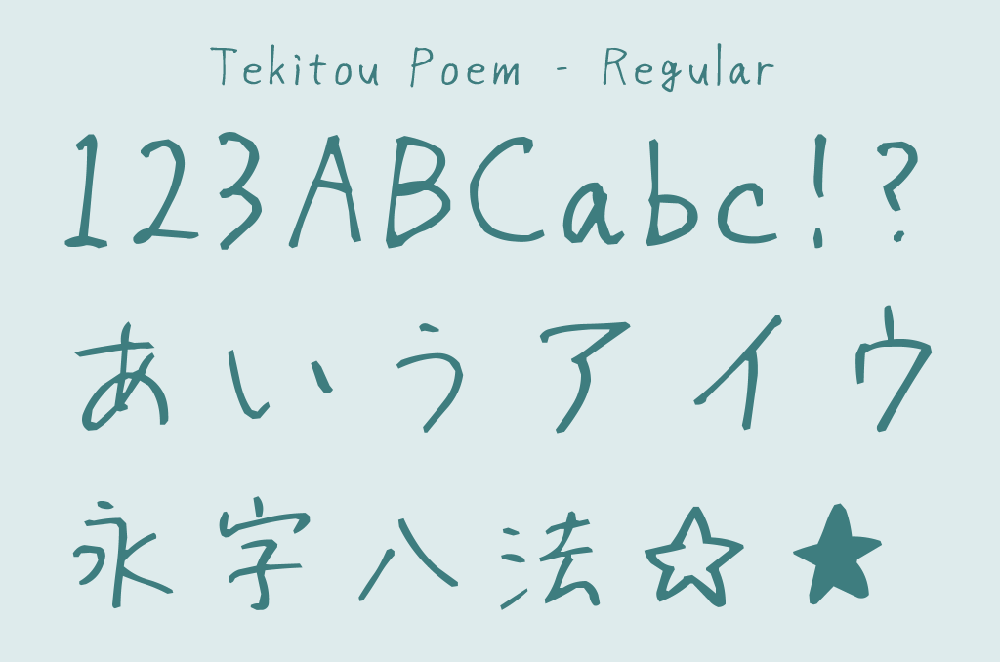
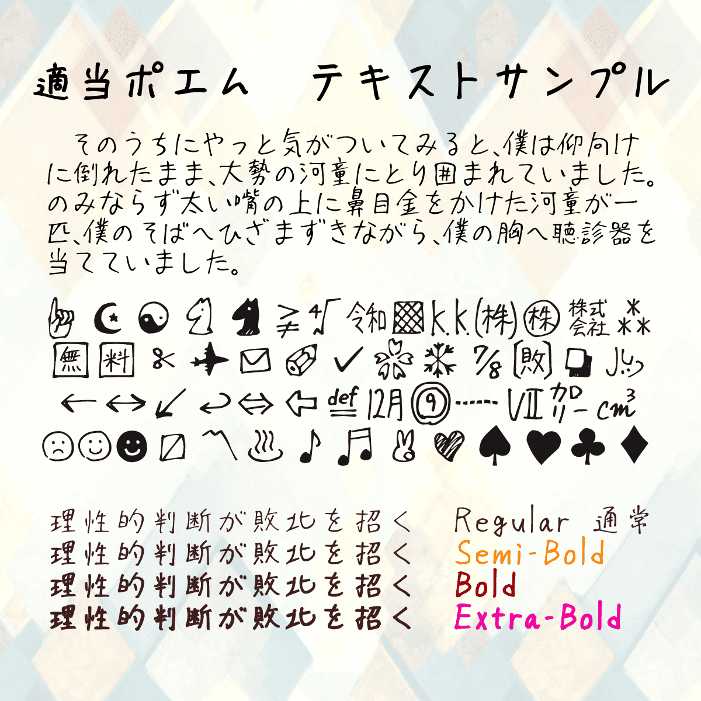
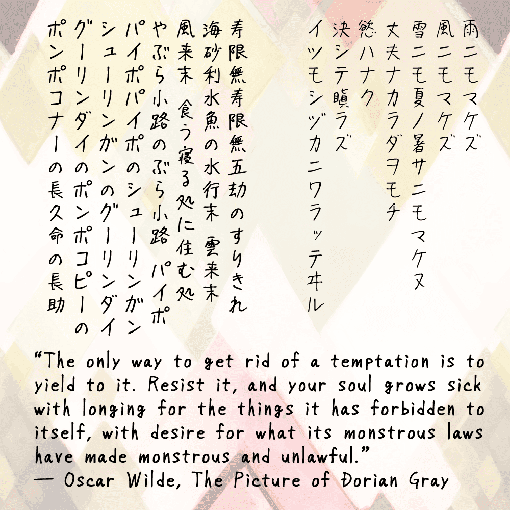

# TekitouPoem-Font  
Handwritten Japanese font — [SIL Open Font License 1.1](https://openfontlicense.org/)  

TekitouPoem is a handwritten Japanese font featuring approximately 16,100 characters.  
It is based on the penmanship of a single person, naturally written with a pen.  
It includes Latin letters, numbers, hiragana, katakana, kanji (JIS Levels 1 to 4), and various symbols.  
The font comes in four weights: Regular, Semi-Bold, Bold, and Extra-Bold. Heavier styles may lose some fine details.

  

The font is occasionally updated to improve its quality. Feedback is welcome if you find any typos or unusual characters.

This font was created by **Hagi42** and is distributed under the independent creator circle name [Cockatrice Digital](https://cktrc.com/).

# 適当ポエムの説明
『適当ポエム』は手書きの日本語フリーフォントです。  
英数字、ひらがな、カタカナ、JIS第1～4水準漢字、その他記号など**16100字**を収録しています。  
文字の丁寧さなどに少しばらつきがあります。

### ライセンス
[SIL Open Font License 1.1](https://openfontlicense.org/) に基づいています。  
イラストや漫画、ゲーム、動画、広告、その他印刷物など、規約の範囲内で自由に使用できます。商用利用可。  
フォントファイルそのものの改変や再配布をしたい場合はライセンスの保持などの制約があるため、注意が必要です。  
ペイントソフトなどで字を装飾したり変形させるのはもちろんOKです。Webフォント化もOKです。

#### 更新情報
2025/04/01 GitHubリポジトリ作成  
2023/05/27 Boothで配布開始  

ここまでの更新情報と作者のポエムはこちらなどから確認できます。  
[https://cktrc.com/tekitoupoem-font/](https://cktrc.com/tekitoupoem-font/)

#### 著作者
このフォントは **Hagi42** が制作し、一次創作サークル [Cockatrice Digital](https://cktrc.com/) 名義で配布しています。

#### ご連絡
誤字の報告やその他ご不明なことなどがありましたら、お気軽にご連絡ください。
